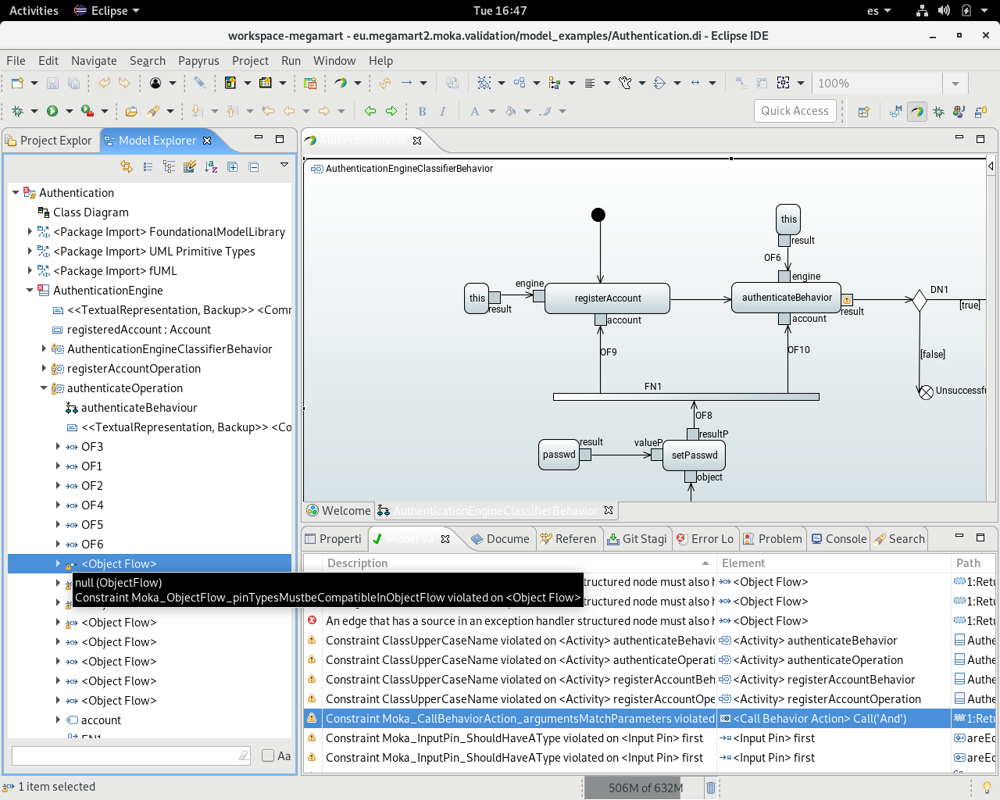
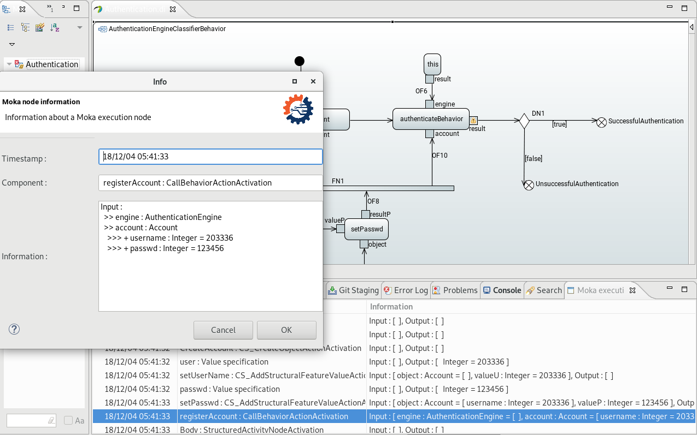

#  MegaM@Rt project: Moka Extensions

This repository contains the code of number of plugins that extend the functionality of Papyrus Moka engine for fUML simulation. It also contains an update site to install them.

## MegaM@Rt Extensions for Moka

- eu.megamart2.moka.validation: this extensions adds additional EMF Validation to fUML models within Papyrus, checking potential model validation issues
- eu.megamart2.moka.logging: this extension adds execution logging to Moka UML model execution

## Installation
The installation of the MegaM@Rt Extensions for Moka follows the standard Eclipse plugin installation precedure.

### Requirements
MegaM@Rt Extensions for Moka require the following software requirements:
- Git
- Eclipse 2018-09 Modeling (or above)
- Papyrus
- Moka

Install Git, Eclipse 2018-09 Modeling, Papyrus and Moka before proceedding to install these Moka extensions. 

### Installation precedure
1. In a command line interface (CMI), pull the **MegaM@Rt Extensions for Moka Repository** to get the update site locally:
`git clone https://gitlab.atosresearch.eu/ari/megamart2-moka.git`
This will create a *megamart2-moka* folder into your local file system

2. In Eclipse, select the top-menu Help/Install New Software. In the Install Wizard, select the Add... button to create a new local repository. Give a name and select the Local... button. Browse your local file system to the Git repository created in previous step. Select the *megamart2-moka/Site/eu.megamart2.moka.extensions.site* folder

3. In Install wizard, select the *MegaM@Rt Extension for Moka* feature, and click on next. Follow next steps, acepting the license and finish. Accept new popup windows that may appear to accept the installation. Restart Eclipse when prompted.

## User Manual

## Validation of executable UML models (fUML comliance).

1. Create a new Papyrus model, selecting *Executable UML* context in first wizard page. Give a project name in next page and finish the wizard.
2. Select the created project in the Project Explorer. Remove the created model (the three files with extensions di, notation, uml). Copy the *Authentication* model files located in *megamart2-moka/Plugins/eu.megamart2.moka.validation/model_examples* into this project folder
3. Open the model into the Papyrus editor by double-clicking in the *Authentication.di* file shown in the project explorer. In Papyrus view, welcome tab, click on *AuthenticationEngineClassifierBehavior* to open the model behavior view.
4. Right click on the Papyrus model graphical view. Select *Validation/Validate Model*.
5. The results of the Moka validation are shown in the *Model Validation View*. New validation constraints added by MegaM@Rt are prefixed with "Moka_"

Validation results are marked for affected model elements on the *Model Explorer* view of the *Papyrus Perspective*, and also in the graphical model view. If you double click on an validation issue in the *Model Validation* view, the corresponding element is highlighted in the model explorer. After fixing each validation issue you can validate again the model and check the results. 

## Execution and logging of UML models.
Above *Authentication* model can be executed using Moka. Create a Moka execution configuration as described in the [Moka Documentation](https://wiki.eclipse.org/Papyrus/UserGuide/ModelExecution#Getting_started_with_Moka)

Launch the Moka configuration for the *Authentication* model. The execution will be shown graphically in the Papyrus UML editor. Simultaneously, execution logs will be displayed in two views:
* The fUML console view.
* The new Moka execution view.

In the execution view log entries are describing the inflows and outflows in/from any behavioral actions of the model, including information about the action, its inputs and outputs at the moment of the logging.
Selecting any log entry with a double click opens a detail windows that renders the log information
Log entries are populated in the temporal order they are provided, which corresponds to the order the actions are executed within the model.

Main contact: Jesús Gorroñogoitia <jesus.gorronogoitia@atos.net>

